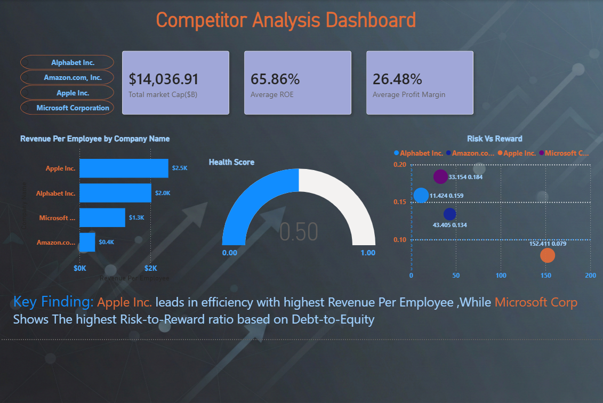

# competitor_analysis
📊 Project Overview

This project is an end-to-end data pipeline designed to analyze the financial health and operational efficiency of major technology competitors. It automates the journey of raw financial data from the web into a structured relational database, culminating in an executive-level Power BI dashboard.

  
  

  
    

🛠️ The Modern Data Stack

    Extraction & Cleaning: Python (yfinance, pandas)

    Database Management: MySQL (Relational Schema Design)

    Data Visualization: Power BI (DAX, Interactive Dashboards)

🚀 Data Pipeline Workflow
1. Python Extraction (ELT)

I developed a script to extract real-time metrics including Market Cap, Revenue, ROE, and Debt-to-Equity.

    Data Cleaning: Handled scientific notation for trillion-dollar figures by normalizing units to Billions (B) and Thousands (K).

    Feature Engineering: Manually calculated Revenue Per Employee to bridge data gaps in the raw API.

2. MySQL Analysis

Data was imported into a MySQL instance using a custom schema. I authored advanced queries to generate business insights:

    Efficiency Leaderboard: Using Window Functions (RANK()) to identify the leanest operators.

3. Power BI Business Intelligence

The final dashboard translates these metrics into actionable visuals:

    Risk vs. Reward Scatter Plot: Visualizes the relationship between high growth and financial leverage.

    Health Score: A custom DAX measure weighting ROE and Profit Margins to provide a single "Management Effectiveness" score.

📈 Key Findings

    Efficiency Leader: Apple Inc. demonstrates superior operational efficiency with the highest Revenue Per Employee in the selected group.

    Risk Profile: Microsoft Corp. showed a distinct risk-to-reward ratio when mapped against sector-standard debt-to-equity baselines.
